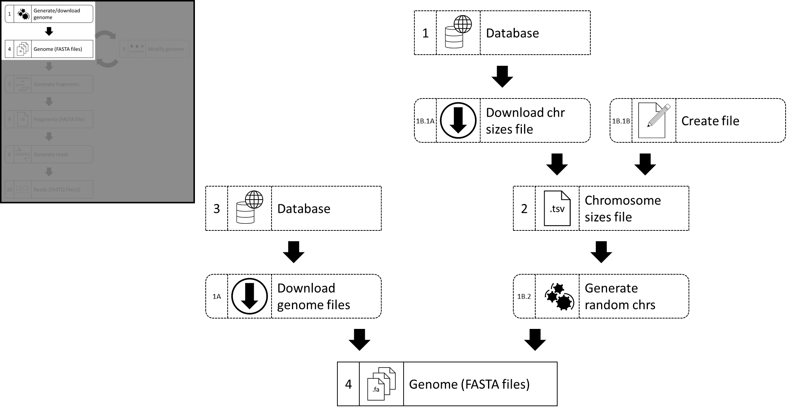

# Summary

Despite being one of the most well-studied genomes in the world with 38 iterations of refinement, the most recent human genome assembly used as a referencing benchmark is still expected to contain errors and ambiguous regions. Aside from very genetically simple organisms, other reference genomes suffer from similar problems. This combines with the potential for experimental error to create multiple levels of uncertainty when attempting to analyse DNA sequencing data, especially when genetic modification is a major focus of the experiments which produced said data. It can be difficult to evaluate the reliability of analysis results, especially when there could potentially be errors or artefacts in the reference data used as a benchmark.

This paper describes the Synthetic In-Silico Genome Generator (SISGG) software package, a modular pipeline which allows users to create and/or modify synthetic genomes in-silico with absolute control and certainty, then generate DNA sequencing data from said genomes, and use this data to evaluate their analysis methods.

# Statement of need

The emergence of low-cost, high-throughput, DNA sequencing technologies has ushered in a new era where many previously unfeasible experiments have become viable. The pioneering nature of scientific research has resulted in many studies where new kinds of data were generated or studies where data needed to be analysed in new ways. This has resulted in the need for new, specialized bioinformatics software. In some cases, there is a scarcity of real-world data which can be used for testing the software being developed. Even when available, real-world data also comes with a plethora of potential problems, including but not limited to experimental artefacts, unpredictable noise, and measurement inaccuracies.

Of especial significance, data from studies which involve the sequencing of genetically modified genomes are subject to multiple layers of uncertainty. A sample may be contaminated in numerous ways. The genetic modification process and the DNA purification and sequencing processes may be either unsuccessful or result in the creation of experimental artefacts. Even if all lab work is carried out without error, the reference data being used as part of the analysis may contain inaccuracies and artefacts of its own. Further complications may be present, depending on the study.

For researchers working in the field of genetics, it would be ideal to have access to data derived from a source which has been characterized with perfect accuracy in its entirety. Such data would allow researchers to benchmark their analysis methods because they will know with absolute certainty which genetic elements are and are not present in their data. Sample contamination, experimental artefacts, measurement inaccuracies, and more, can also be simulated in a completely controlled manner. This deliberately sub-optimal data will allow researchers to gauge the error tolerance of their analysis methods, further strengthening their conclusions when analysing real-world data. 
Using simulated data for parameter testing and for pilot analyses is also unconstrained by time, resource, and ethics considerations which may apply to gathering real-world data.

# Novelty

The novelty of SISGG mainly lies in its genome editing and changes tracking system. Instead of creating hard copies of the template genome and modifying it, SISGG uses a referential system and syntactical formulas to specify edits to the genome. This system places emphasis on specific sequences of interest from among what could be billions of nucleotides, instead of treating the entire genome as an amorphous swamp of DNA. Users may create soft copies of a template genome by copying the coordinates file and editing that file instead. Since the referential formulas are both human-readable and machine-readable, users may specify the changes they wish to see by editing the contents of these formulas, with no need to trawl through billions of “A”s, “C”s, “G”s, and “T”s. Only when users are satisfied are the coordinates files used to create a hard copy of the now-modified genome.

There are at least 35 different software packages which can generate sequencing reads using a part or the entirety of an input reference genome. Many of those packages place emphasis on mimicking the error distributions, quality degradation patterns, and other such factors, as closely as possible for some or all the next-gen sequencing technologies available. SISGG’s own native read generation process is likely inferior to those packages in those aspects. However, in an era where gigabases worth of data can be generated from a single machine run, and where most sequenced bases are more than 99.9% accurate, researchers can afford to impose extremely stringent filtering criteria on their raw reads, and still retain many reads to use in the subsequent steps of the analysis. Those high fidelity error pattern simulators are technically impressive, but offer little additional practical benefit to researchers testing their analysis software. Furthermore, many of those programs directly generate sequencing reads from the input genomes without the use of a DNA fragments file as an intermediate. This denies users the option to simulate the modification and purification of DNA fragments. However, users may use the edited genomes generated by the SISGG pipeline as inputs for alterative reads generator programs if they wish.

The Random DNA Generator can be used to generate random DNA sequences of a specified length. This is similar to the first step in the SISGG pipeline, but only generates one sequence at a time, which is equivalent to generating a genome chromosome by chromosome. SISGG instead takes a chromosome sizes file and generates a genome based on the given specifications. The Random DNA Generator is also a browser-based tool, making it difficult to integrate into a computing cluster.

# Methodology

The SISGG pipeline is a flexible, modular pipeline with multiple points of intervention and the option to copy and modify data an infinite number of times. Users may freely utilize scripts to modify the input, intermediate, and/or output files in accordance with the needs of their specific research projects, if such modifications are not possible with the SISGG toolset.

Users begin the process by obtaining a genome in the form of DNA sequence files, either by downloading pre-existing genome assemblies, or by generating a series of random nucleotides of user-specified length. This genome will function as a base template for all modifications.

Users may then extract or insert DNA sequences into the template. With DNA insertion, users may use DNA sequences from other sources, including other genomes. Templates may undergo as many insertion and/or extraction steps as needed. All changes are tracked and documented in a human-readable manner. Users will not need to manually scroll through the DNA sequence files, which can be billions of characters in length, to implement or confirm these changes.

Once the genome(s) have been satisfactorily modified, users may then simulate the DNA sequencing process by generating DNA fragments from the genomes, and then generating DNA sequencing reads from the DNA fragments. Users may also use their own scripts to simulate modifications or refinement of the DNA fragments before the final sequencing step. This is a direct parallel to the steps, of DNA fragmentation and DNA fragment modification and purification, in many wetlab experiments.
After the sequencing reads have been generated, they may undergo bioinformatics analysis in an identical manner to how real-world data is analysed.

# Figures

# Acknowledgements

We acknowledge Doctor Laura Leighton for consulting us on aspects of genomics and DNA sequencing, as well as her feedback and encouragement.